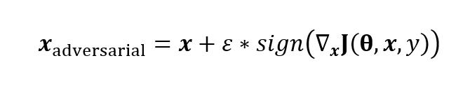
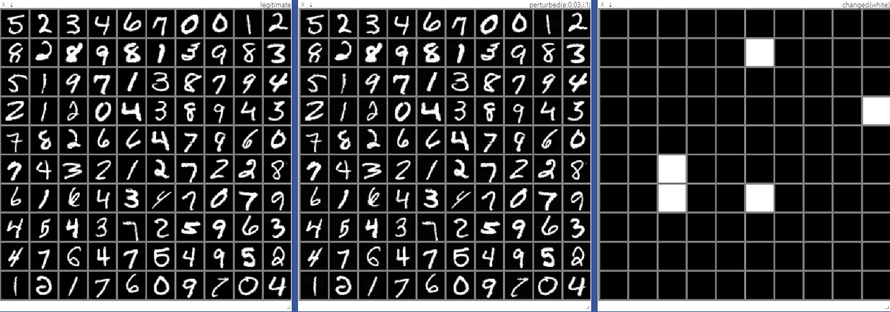

# FGSM(Fast Gradient Sign Method)
<br>

### Overview 
Simple pytorch implementation of FGSM( from this paper : [EXPLAINING AND HARNESSING ADVERSARIAL EXAMPLES] )
  

<br>

### Dependencies
```
python 3.6.4
pytorch 0.3.1.post2
visdom(optional)
tensorboardX(optional)
tensorflow(optional)
```
<br>

### Usage
1. train a simple MNIST classifier
```
python main.py --mode train --env_name [MODEL_NAME]
```
2. load trained classifier, generate adversarial examples, and then see outputs in the output directory
```
python main.py --mode generate --iteration 1 --epsilon 0.03 --env_name [MODEL_NAME] --load_ckpt best_acc.tar
```
<br>

### Result
from the left, legitimate examples, perturbed examples, and indication of perturbed images that changed predictions of the classifier

1. iteration : 1, epsilon : 0.03

2. iteration : 5, epsilon : 0.03

1. iteration : 1, epsilon : 0.5

<br>

### To Do
- [ ] add cifar10
- [ ] add targeted/untargeted generation mode

[EXPLAINING AND HARNESSING ADVERSARIAL EXAMPLES]: https://arxiv.org/abs/1412.6572
